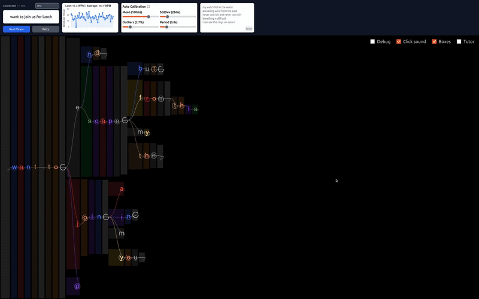

# Dotter: An Adaptive Single-Switch Text-Entry System


*Dotter enables typing at 20wpm with a single input (e.g. spacebar, blinking). Users synchronize
their gestures to the timer of their target prefix.*


## Running Locally

Clone the Repository
```sh
git clone https://github.com/oscarlaird/dotter
cd dotter
```
Install Requirements for Language Server
```sh
pip install -r requirements.txt
```
Launch Language Server
```sh
python lm.py
```

Serve Frontend
```sh
npm run dev
```
View the Application
Open your browser and go to:
```
localhost:5173/v2
```
