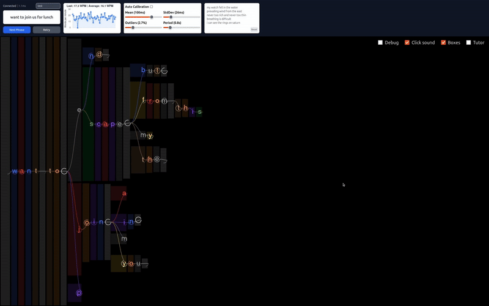

# Dotter: An Adaptive Single-Switch Text-Entry System


*Dotter enables typing at 20wpm with a single input (e.g. spacebar, blinking). Users synchronize
their gestures to the timer of their target prefix.*

## Repository layout

| Path | Contents |
|------|----------|
| `frontend/` | Vite + React web UI |
| `language_server/` | Python WebSocket LM server (`lm.py`) and Poetry project |
| `demos/` | Lean, Rust, and TypeScript interop examples |
| `formal/proof/` | Lean formalization (Lake) |
| `math/tex/` | LaTeX write-up (`math.tex` and `chapters/`) |
| `math/scripts/` | Python notebooks / experiments tied to the math write-up |
| `experiments/` | Ad-hoc experiments (scratch space) |

## Running Locally

Clone the Repository
```sh
git clone https://github.com/oscarlaird/dotter
cd dotter
```
Install Requirements for Language Server
```sh
pip install -r language_server/requirements.txt
```
Launch Language Server
```sh
python language_server/lm.py
```

Serve Frontend
```sh
npm install --prefix frontend
npm run dev
```
View the Application
Open your browser and go to:
```
localhost:5173/v2
```

Stiff, slow, unhurried, feel that the circles are turning very slowly, never reactive. (super fast period (340ms) helped a lot to kick me into this state; 2x confirmed)
Looking ahead, concentrating and not thinking about other things.
Not feeling oneself to be blinking but willing.
